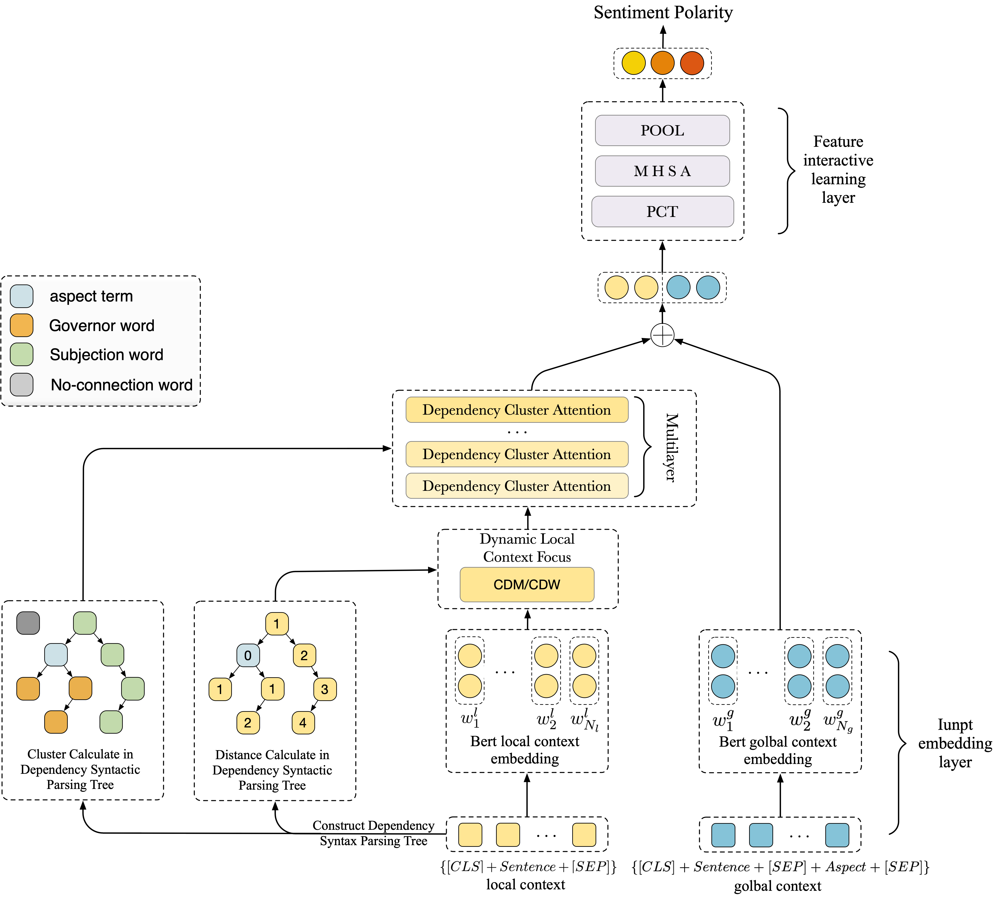

# DLCF-DCA
 codes for paper Combining Dynamic Local Context Focus and Dependency Cluster Attention for Aspect-level sentiment classification. submitted to 《Neurocomputing》.

# Requirement
* Python >= 3.6 <br> 
* PyTorch >= 1.0 <br> 
* pytorch-transformers == 1.2.0 <br> 

# Training
```
python train.py --model dlcf_dca
```
#  Model Architecture


# Note
Some important scripts to note:
* datasets/semeval14/*.seg: Preprocessed training and testing sentences in SemEval2014.
* datasets/semeval15/*.seg: Preprocessed training and testing sentences in SemEval2015.
* datasets/semeval16/*.seg: Preprocessed training and testing sentences in SemEval2016.
* models/dlcf_dca.py: the source code of DLCF_DCA model.
* data_utils.py/ABSADataSet class: preprocess the tokens and calculates the shortest distance to target words and cluster via the Dependency Syntax Parsing Tree.

# Acknowledgement
We have based our model development on https://github.com/songyouwei/ABSA-PyTorch. Thanks for their contribution.

